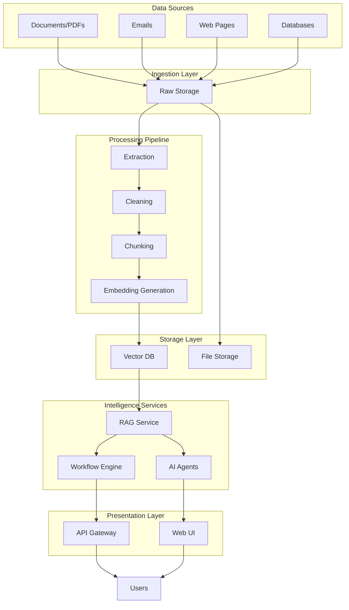

# Intellix

AI-Powered Knowledge Intelligence & Automation Platform.

Transforms organizational knowledge into secure, explainable and actionable workflows.

## 🚀 Quick Overview

Intellix is an enterprise platform that ingests unstructured data (documents, PDFs, emails, websites), extracts intelligence using AI, and exposes it through:

- **Conversational AI Agents**: Natural language interfaces for knowledge retrieval.
- **Automated Workflows**: Business process automation triggered by insights.
- **Secure Knowledge Base**: Enterprise-grade storage with access controls.

## 🏗️ Architecture



## 📦 Project Structure

```
Intellix/
├── apps/
│   ├── api/            # REST API & endpoints
│   └── web/            # Frontend application
├── services/
│   ├── rag-service/    # RAG pipeline & vector operations
│   ├── agent-service/  # AI agent orchestration
│   └── workflow-service/ # Business process automation
├── infrastructure/
│   └── docker/         # Docker configurations
├── evaluation/
│   ├── datasets/       # Evaluation datasets
│   └── reports/        # Evaluation results
├── docs/
│   ├── architecture.md   # System architecture
│   ├── installation.md # Setup guide
│   └── api.md          # API documentation
├── .env.example        # Environment variables
├── .gitignore
└── README.md
```

## 🚀 Getting Started

### Prerequisites

- Python 3.10+
- Node.js 18+
- Docker Desktop (optional)

### Installation

1. Clone the repository:
   ```bash
   git clone <repository-url>
   cd Intellix
   ```

2. Configure environment variables:
   ```bash
   cp .env.example .env
   ```
   Edit `.env` with your API keys and configuration.

3. Install dependencies:
   ```bash
   # Backend
   cd apps/api
   pip install -r requirements.txt
   
   # Frontend
   cd ../web
   npm install
   ```

### Running the Application

#### Option 1: Docker (Recommended)

```bash
# Start all services
docker-compose up -d

# Access the application
# Web: http://localhost:3000
# API: http://localhost:8000
```

#### Option 2: Local Development

```bash
# Start API
cd apps/api
uvicorn main:app --reload

# Start Web
cd ../web
npm run dev
```

## 🛠️ Key Features

- ✅ **Intelligent Search**: Semantic search across organizational knowledge
- ✅ **AI Agents**: Natural language conversational interfaces
- ✅ **Workflow Automation**: Automated processes triggered by insights
- ✅ **Document Processing**: Extract text from PDFs, DOCX, TXT, etc.
- ✅ **Web Content Scraping**: Ingest public web content
- ✅ **Database Integration**: Connect to existing data sources
- ✅ **Role-Based Access Control**: Secure multi-user environment
- ✅ **Audit Trail**: Track all operations and agent interactions
- ✅ **Scalable Architecture**: Microservices-based design

## 📂 Service Details

### RAG Service

The core of the knowledge system. Handles:
- Document ingestion and processing
- Embedding generation using OpenAI/HuggingFace
- Vector similarity search
- Context retrieval for AI agents

### Agent Service

Provides conversational AI capabilities:
- Natural language query processing
- Information retrieval from RAG service
- Integration with large language models (LLMs)
- Response generation with citations

### Workflow Service

Automates business processes:
- Trigger-based automation
- Data extraction and transformation
- Integration with external systems
- Approval workflows

## ⚙️ Configuration

Create a `.env` file in the project root with the following variables:

```env
# OpenAI API key
OPENAI_API_KEY=your_openai_key

# Vector database configuration
VECTOR_DB=qdrant
QDRANT_URL=http://localhost:6333

# Model settings
EMBEDDING_MODEL=text-embedding-ada-002

# API ports
API_PORT=8000
WEB_PORT=3000
```

## 📚 Documentation

- [System Architecture](docs/architecture.md)
- [Installation Guide](docs/installation.md)
- [API Reference](docs/api.md)

## 🧪 Evaluation

For development and evaluation:
```bash
# Run evaluation datasets
cd evaluation
python run_evaluations.py
```

Results will be saved to the `evaluation/reports/` directory.

## 🤝 Contributing

Contributions are welcome! Please follow these steps:

1. Create a feature branch
2. Make your changes
3. Test your changes
4. Submit a pull request

## 📝 License

Private project - all rights reserved.